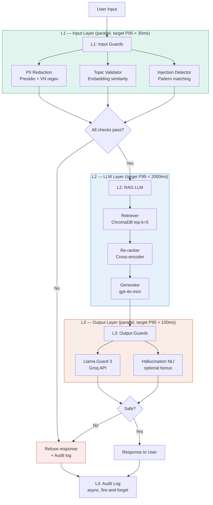

# Production Blueprint — Full Evaluation & Guardrail System

**Project:** RAG Pipeline Evaluation & Safety Stack  
**Lab:** AICB-P2T3 · Day 24 · VinUniversity  
**Version:** 1.0  
**Ngày:** ___________  
**Tác giả:** ___________

---

## Section 1 — SLO Definition

### Service Level Objectives

| Metric | Target | Alert Threshold | Window | Severity |
|--------|--------|-----------------|--------|----------|
| Faithfulness | ≥ 0.85 | < 0.80 liên tục 30 phút | Sliding 1h | P2 |
| Answer Relevancy | ≥ 0.80 | < 0.75 liên tục 30 phút | Sliding 1h | P2 |
| Context Precision | ≥ 0.70 | < 0.65 liên tục 1 giờ | Sliding 2h | P3 |
| Context Recall | ≥ 0.75 | < 0.70 liên tục 1 giờ | Sliding 2h | P3 |
| P95 latency (full stack) | < 2.5s | > 3.0s liên tục 5 phút | Sliding 10m | P1 |
| Guardrail detection rate | ≥ 90% | < 85% | Daily | P2 |
| Guardrail false positive rate | < 5% | > 10% | Daily | P2 |
| PII redaction recall | ≥ 95% | < 90% | Daily | P1 |

### Error Budget

| SLO | Monthly budget (30 ngày) | Budget tương đương |
|-----|--------------------------|-------------------|
| P95 latency < 2.5s | 99.5% requests | ~2.5 giờ downtime |
| Faithfulness ≥ 0.85 | 95% eval windows pass | ~36 giờ degraded |
| Guardrail detection ≥ 90% | 99% days pass | ~7 giờ gap |

### Measurement methodology

- **RAGAS:** Chạy continuous eval trên 1% production queries (sample ngẫu nhiên, async).
  Mỗi eval batch: 50 questions, chạy mỗi giờ. Cost ~$0.10/batch.
- **Latency:** Measured end-to-end từ request nhận được đến response gửi đi, bao gồm
  L1 guardrails, LLM inference, L3 output check. L4 audit log không tính vào budget.
- **Guardrail metrics:** Daily audit trên 100 random conversations (50 user inputs + 50 outputs).
  Human review 10% sample mỗi tuần để track drift.

---

## Section 2 — Architecture Diagram

### Defense-in-depth stack



### Latency budget breakdown

```
User → [L1 parallel] → [L2 RAG] → [L3 parallel] → User
         ~30ms P95       ~1800ms     ~80ms P95
                                                    Total: ~1910ms P95
```

| Layer | Component | P50 | P95 | Notes |
|-------|-----------|-----|-----|-------|
| L1 | PII Redaction | ~8ms | ~20ms | Presidio NER + VN regex |
| L1 | Topic Validator | ~15ms | ~28ms | Embedding similarity |
| L1 | (parallel overhead) | — | ~30ms | max của 2 tasks |
| L2 | Retriever (ChromaDB) | ~30ms | ~80ms | top-k=5 |
| L2 | Re-ranker | ~100ms | ~200ms | nếu có |
| L2 | LLM Generation | ~800ms | ~1800ms | gpt-4o-mini |
| L3 | Llama Guard (Groq) | ~40ms | ~90ms | API call |
| L4 | Audit log | async | — | không tính vào budget |
| **Total** | | **~900ms** | **~1910ms** | **vs target 2500ms** |

### Component inventory

| Component | Technology | Hosting | Thay thế nếu cần |
|-----------|-----------|---------|-----------------|
| Vector DB | ChromaDB | Self-hosted | Pinecone, Weaviate |
| Embedding | text-embedding-3-small | OpenAI API | sentence-transformers |
| Generator | gpt-4o-mini | OpenAI API | Claude Haiku |
| PII Redaction | Presidio + custom regex | Self-hosted | AWS Comprehend |
| Topic Validator | OpenAI embedding | OpenAI API | Local sentence-transformers |
| Output guard | Llama Guard 3 8B | Groq API | Self-hosted (GPU) |
| Eval framework | RAGAS ≥ 0.2.0 | Self-hosted | — |
| Observability | LangSmith / Langfuse | Cloud (free tier) | Self-hosted Langfuse |
| Audit log | PostgreSQL / BigQuery | Managed | S3 JSON |

---

## Section 3 — Alert Playbook

### Incident format

Mỗi incident định nghĩa: trigger → likely causes → investigation steps → resolution → SLO impact.

---

### Incident P1-001 — P95 latency spike (> 3.0s)

**Severity:** P1  
**Trigger:** P95 end-to-end latency > 3.0s trong 5 phút liên tục  
**On-call:** Ngay lập tức — wake up nếu ngoài giờ làm việc

**Likely causes (theo thứ tự xác suất):**

1. OpenAI API latency tăng đột biột (phổ biến nhất)
2. ChromaDB query chậm — index fragmented hoặc disk I/O cao
3. Groq API timeout (L3)
4. Network latency giữa services tăng

**Investigation steps:**

```bash
# Step 1: Check layer breakdown từ latency_benchmark.csv hoặc LangSmith
# L1, L2, L3 layer nào chậm?

# Step 2: Check OpenAI status
curl https://status.openai.com/api/v2/status.json | jq .status

# Step 3: Check ChromaDB query time
python scripts/check_db_latency.py --last 100

# Step 4: Check Groq API
curl https://api.groq.com/openai/v1/models -H "Authorization: Bearer $GROQ_API_KEY"
```

**Resolution:**

| Cause | Action |
|-------|--------|
| OpenAI API chậm | Switch sang Claude Haiku fallback; notify users về degraded mode |
| ChromaDB chậm | Restart ChromaDB, hoặc scale read replica |
| Groq timeout | Fallback sang simplified output check (regex-based) hoặc skip L3 tạm thời |
| Network | Check cloud provider status, escalate nếu cần |

**SLO impact tracking:**
- TTD (Time to Detect): target < 5 phút (alert delay + human ack)
- TTR (Time to Recover): target < 30 phút
- Ghi vào incident log: `incidents/P1-001-YYYYMMDD.md`

---

### Incident P2-001 — Faithfulness drops below 0.80

**Severity:** P2  
**Trigger:** Faithfulness < 0.80 trong eval window ≥ 30 phút liên tục  
**Response time:** Trong 2 giờ làm việc tiếp theo

**Likely causes:**

1. Retriever trả về chunks không relevant — Context Precision cũng drop
2. LLM prompt version đã bị thay đổi (prompt drift)
3. Document corpus được update mà không re-index
4. Test distribution shift — loại câu hỏi mới từ users

**Investigation steps:**

```python
# Step 1: Check CP cùng timeframe — nếu CP cũng drop → retrieval issue
# Nếu chỉ F drop mà CP OK → LLM generation issue

# Step 2: Check prompt version
git log --oneline prompts/ | head -5
git diff HEAD~1 prompts/rag_prompt.txt

# Step 3: Check document update log
cat logs/document_updates.log | tail -20

# Step 4: Xem sample failures
python scripts/sample_failures.py --metric faithfulness --threshold 0.6 --n 10
```

**Resolution:**

| Cause | Action |
|-------|--------|
| Retrieval issue | Tăng top_k tạm thời (5 → 7), re-run eval để confirm |
| Prompt drift | `git revert` về prompt version cuối cùng có F ≥ 0.85 |
| Corpus outdated | Re-run indexing pipeline: `python scripts/reindex.py --full` |
| Distribution shift | Flag để review, consider thêm training data cho weak areas |

**SLO impact:** TTD target < 1h (eval chạy mỗi giờ), TTR target < 4h

---

### Incident P2-002 — Guardrail false positive rate > 10%

**Severity:** P2  
**Trigger:** FP rate trên daily audit > 10%  
**Response time:** Trong ngày làm việc

**Likely causes:**

1. Topic validator threshold quá strict — đang block legitimate queries
2. PII regex match false positives (ví dụ: CCCD regex bắt nhầm số khác)
3. Llama Guard phân loại sai loại content specific trong domain
4. Adversarial users đang craft legitimate-looking queries bị block

**Investigation steps:**

```python
# Step 1: Pull blocked queries từ audit log
python scripts/audit_analysis.py --date today --verdict blocked --n 50

# Step 2: Tìm false positives — manual review 20 samples
# Câu nào bị block mà không nên?

# Step 3: Check phân bố theo layer
# L1-PII bao nhiêu? L1-topic bao nhiêu? L3 bao nhiêu?

# Step 4: Check regex false matches
python scripts/test_pii_regex.py --corpus audit_fp_samples.txt
```

**Resolution:**

| Cause | Action |
|-------|--------|
| Topic threshold quá strict | Điều chỉnh similarity threshold từ 0.6 → 0.55 |
| PII regex FP | Review và narrow regex pattern; thêm whitelist cho known-safe patterns |
| Llama Guard FP | Thêm domain-specific examples vào few-shot prompt hoặc switch về rule-based |
| Adversarial FPs | Log để analyze, không action ngay |

**SLO impact:** TTD = daily (audit chạy 1 lần/ngày), TTR target < 1 ngày

---

### Incident P3-001 — Context Recall < 0.70 (sustained)

**Severity:** P3  
**Trigger:** Context Recall < 0.70 trong eval window ≥ 1 giờ  
**Response time:** Trong 2 ngày làm việc

**Likely causes:**

1. Document corpus cần re-index (stale chunks)
2. top_k quá thấp cho loại câu hỏi phổ biến mới
3. Embedding model drift (nếu dùng model được update)

**Investigation steps:**

```bash
# Check corpus freshness
python scripts/check_index_freshness.py

# Sample low-recall questions
python scripts/sample_failures.py --metric context_recall --threshold 0.5 --n 10
```

**Resolution:**

| Cause | Action |
|-------|--------|
| Stale index | `python scripts/reindex.py --incremental` |
| top_k thấp | Tăng top_k từ 5 → 7 (test trước trên eval set) |
| Embedding drift | Pin embedding model version trong `requirements.txt` |

---

## Section 4 — Cost Analysis

### Assumptions

- Volume: 100,000 queries/tháng (~3,300 queries/ngày)
- Continuous eval: 1% sampling = 1,000 queries/tháng qua RAGAS
- LLM-Judge: Chạy hàng tuần trên 500 samples (automated), human review 50 samples
- Groq: Dùng free tier cho Llama Guard (100,000 tokens/ngày, đủ cho volume này)

### Monthly cost breakdown

| Component | Unit cost | Volume/tháng | Monthly cost |
|-----------|-----------|--------------|--------------|
| RAG generation (gpt-4o-mini) | ~$0.001/query | 100,000 | $100 |
| Embedding (text-embedding-3-small) | ~$0.0001/query | 100,000 | $10 |
| RAGAS continuous eval (1% sample) | ~$0.05/eval | 1,000 | $50 |
| LLM Judge — automated (gpt-4o-mini) | ~$0.001/pair | 2,000 pairs | $2 |
| LLM Judge — deep review (gpt-4o) | ~$0.03/pair | 200 pairs | $6 |
| Topic validator (embedding) | ~$0.0001/query | 100,000 | $10 |
| Llama Guard 3 (Groq free tier) | $0 | 100,000 | $0 |
| ChromaDB (self-hosted) | server cost | — | ~$20 |
| LangSmith/Langfuse (free tier) | $0 | 100,000 | $0 |
| **Total** | | | **~$198/tháng** |

### Comparison: self-hosted vs API

| Component | Self-hosted | API (current) | Trade-off |
|-----------|-------------|---------------|-----------|
| Llama Guard 3 8B | ~$216/tháng (GPU A10G) | $0 (Groq free) | Free tier limit: 100k tokens/ngày |
| Embedding | ~$15/tháng (CPU server) | ~$10 (OpenAI) | Self-hosted: privacy + latency tốt hơn |
| Generator | ~$50+/tháng (GPU) | ~$100 (OpenAI) | OpenAI: simpler, more reliable |

**Groq free tier limit:** 100,000 tokens/ngày ≈ ~5,000 requests/ngày (nếu mỗi request ~20 tokens output).
Ở volume 3,300 queries/ngày: **đủ dùng với free tier**. Khi scale > 10,000/ngày cần upgrade Groq hoặc self-host.

### Cost optimization opportunities

| Opportunity | Current | Optimized | Saving |
|-------------|---------|-----------|--------|
| Giảm RAGAS sample rate từ 1% → 0.5% | $50 | $25 | -$25 |
| Cache embedding cho repeated queries | $10 | $4 | -$6 |
| Dùng gpt-4o-mini cho tất cả judge tasks | $8 | $2 | -$6 |
| Batch RAGAS eval theo giờ thấp điểm | $50 | $40 | -$10 |
| **Tổng tiết kiệm** | **$198** | **~$151** | **-$47 (~24%)** |

---

## Appendix — Prompts used (academic integrity)

Xem file [`prompts.md`](../prompts.md) để biết danh sách đầy đủ các AI prompts đã sử dụng trong quá trình làm lab.

---

## Appendix — References

- RAGAS paper: Es et al., "RAGAS: Automated Evaluation of Retrieval Augmented Generation" (2023)
- LLM-as-Judge: Zheng et al., "Judging LLM-as-a-Judge with MT-Bench and Chatbot Arena" (2023)
- Llama Guard: Meta AI, "Llama Guard: LLM-based Input-Output Safeguard" (2023)
- Cohen's Kappa: Cohen, J. "A coefficient of agreement for nominal scales" (1960)
- Presidio: Microsoft, https://github.com/microsoft/presidio
