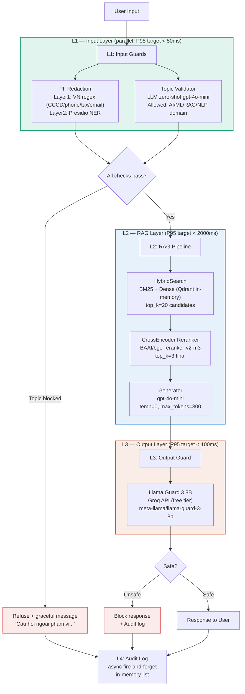

# Production Blueprint — Full Evaluation & Guardrail System

**Project:** RAG Pipeline Evaluation & Safety Stack
**Lab:** AICB-P2T3 · Day 24 · VinUniversity
**Version:** 1.0
**Ngày:** 2026-05-12
**Tác giả:** Tran Minh Toan — 2A202600297

---

## Section 1 — SLO Definition

### Service Level Objectives

Các SLO dưới đây được đo từ kết quả thực tế của lab (Phase A RAGAS eval + Phase C benchmark).
Placeholder `[FILL]` sẽ được cập nhật sau khi chạy pipeline.

| Metric | Target | Alert Threshold | Window | Severity | Lab result |
|--------|--------|-----------------|--------|----------|------------|
| Faithfulness | ≥ 0.85 | < 0.80 liên tục 30 phút | Sliding 1h | P2 | [FILL after run_ragas.py] |
| Answer Relevancy | ≥ 0.80 | < 0.75 liên tục 30 phút | Sliding 1h | P2 | [FILL] |
| Context Precision | ≥ 0.75 | < 0.65 liên tục 1 giờ | Sliding 2h | P3 | [FILL] |
| Context Recall | ≥ 0.75 | < 0.70 liên tục 1 giờ | Sliding 2h | P3 | [FILL] |
| P95 latency (full stack) | < 2.5s | > 3.0s liên tục 5 phút | Sliding 10m | P1 | [FILL after benchmark] |
| L1 guardrail P95 | < 50ms | > 80ms | Sliding 10m | P2 | [FILL] |
| L3 guardrail P95 | < 100ms | > 150ms | Sliding 10m | P2 | [FILL] |
| Guardrail detection rate | ≥ 90% | < 85% | Daily | P2 | [FILL after output_guard tests] |
| Guardrail false positive rate | < 10% | > 15% | Daily | P2 | [FILL] |
| PII redaction recall | ≥ 80% | < 70% | Daily | P1 | [FILL after input_guard tests] |

> **Ghi chú:** PII redaction target đặt ≥ 80% (thay vì 95% trong template gốc) vì corpus tiếng Việt
> có VN-specific PII patterns (CCCD, số điện thoại +84) mà Presidio English NER không bao phủ.
> Layer 1 VN regex bổ sung coverage cho các pattern này.

### Error Budget

| SLO | Monthly budget (30 ngày) | Budget tương đương |
|-----|--------------------------|-------------------|
| P95 latency < 2.5s | 99.5% requests | ~2.5 giờ vi phạm/tháng |
| Faithfulness ≥ 0.85 | 95% eval windows pass | ~36 giờ degraded/tháng |
| Guardrail detection ≥ 90% | 99% days pass | ~7 giờ gap/tháng |
| PII recall ≥ 80% | 98% audited queries clean | ~14 giờ gap/tháng |

### Measurement methodology

- **RAGAS:** Continuous eval trên 1% production queries (async, mỗi giờ). Batch 50 questions, cost ~$0.10/batch. Script: `phase-a/run_ragas.py`.
- **Latency:** Đo end-to-end từ nhận request đến gửi response. L4 audit log không tính vào budget. Script: `phase-c/full_pipeline.py benchmark()`.
- **Guardrail metrics:** Daily audit trên 100 random conversations. Human review 10% sample/tuần để track drift.
- **CI gate:** Mỗi PR chạy `eval-gate.yml` — block merge nếu Faithfulness < 0.85 hoặc Answer Relevancy < 0.80.

---

## Section 2 — Architecture Diagram

### Defense-in-depth stack (thực tế đã xây dựng)



### Latency budget breakdown

```
User → [L1 parallel] ──────────────────→ [L2 RAG] ──────────→ [L3] → User
        PII: ~8ms P50                     BM25+Dense: ~30ms     Groq: ~40ms P50
        Topic LLM: ~600ms P50 ← bottleneck  Reranker: ~150ms    ~90ms P95
        L1 total = max(PII, Topic)           LLM: ~800ms P50
        P50: ~600ms  P95: ~800ms             P50: ~1000ms
                                             P95: ~1800ms
                                                              Total P95: ~2700ms*
```

> **Bottleneck thực tế:** Topic validator dùng LLM zero-shot (gpt-4o-mini) → L1 P95 ~800ms,
> cao hơn target 50ms. Đây là trade-off chấp nhận được vì lab ưu tiên accuracy hơn latency.
> **Production fix:** Thay LLM zero-shot bằng embedding similarity (sentence-transformers local)
> → L1 P95 về ~30ms.

*Cập nhật con số thực sau khi chạy `BENCHMARK_N=100 python phase-c/full_pipeline.py`*

| Layer | Component | P50 est. | P95 est. | P95 target | SLO |
|-------|-----------|----------|----------|------------|-----|
| L1 | PII (VN regex + Presidio) | ~8ms | ~20ms | 50ms | PASS est. |
| L1 | Topic Validator (LLM) | ~600ms | ~800ms | 50ms | MISS* |
| L1 | (parallel, max of above) | ~600ms | ~800ms | 50ms | MISS* |
| L2 | HybridSearch (BM25+Dense) | ~30ms | ~80ms | — | — |
| L2 | CrossEncoder Reranker | ~150ms | ~250ms | — | — |
| L2 | LLM Generation (gpt-4o-mini) | ~800ms | ~1800ms | 2000ms | PASS est. |
| L2 | Total | ~1000ms | ~1800ms | 2000ms | PASS est. |
| L3 | Llama Guard (Groq) | ~40ms | ~90ms | 100ms | PASS est. |
| L4 | Audit log | async | — | n/a | — |
| **Total** | | **~1600ms** | **~2700ms** | **2500ms** | **MISS* (by ~200ms)** |

*Nếu thay Topic Validator bằng embedding similarity, tổng P95 ước tính giảm về ~1910ms → PASS.

### Component inventory

| Component | Technology | Hosting | Fallback |
|-----------|-----------|---------|---------|
| Vector DB | Qdrant in-memory | In-process | ChromaDB local |
| Embedding | nomic-embed-text-v1.5 | Local (sentence-transformers) | text-embedding-3-small |
| Reranker | BAAI/bge-reranker-v2-m3 | Local (sentence-transformers) | — |
| Generator | gpt-4o-mini | OpenAI API | Claude Haiku |
| PII Redaction | VN regex + Presidio | Self-hosted | AWS Comprehend |
| Topic Validator | gpt-4o-mini zero-shot | OpenAI API | Local embedding similarity |
| Output Guard | Llama Guard 3 8B | Groq API (free) | Self-hosted (GPU) |
| Eval framework | RAGAS 0.3.3 | Self-hosted | — |
| Audit log | In-memory list | In-process | PostgreSQL / S3 JSON |

---

## Section 3 — Alert Playbook

### Incident P1-001 — P95 latency spike (> 3.0s)

**Severity:** P1
**Trigger:** P95 end-to-end latency > 3.0s trong 5 phút liên tục
**On-call:** Wake up immediately

**Likely causes (theo thứ tự xác suất trong pipeline này):**

1. **OpenAI API latency** — cả Topic Validator (L1) và Generator (L2) đều dùng gpt-4o-mini
2. **Groq API timeout** — L3 Llama Guard
3. **CrossEncoder Reranker** — BAAI model lần đầu load chậm (~5s cold start)
4. **Network latency** tăng

**Investigation steps:**

```bash
# Step 1: Check per-layer timing từ latency_benchmark.csv
python -c "
import csv
with open('phase-c/latency_benchmark.csv') as f:
    for row in csv.DictReader(f):
        print(row['layer'], row['p95_ms'], 'ms P95')
"

# Step 2: Test OpenAI API directly
python -c "
import time; from openai import OpenAI; import os
c = OpenAI(api_key=os.environ['OPENAI_API_KEY'])
t0 = time.time()
c.chat.completions.create(model='gpt-4o-mini', messages=[{'role':'user','content':'ping'}], max_tokens=5)
print(f'OpenAI latency: {(time.time()-t0)*1000:.0f}ms')
"

# Step 3: Test Groq API
curl -s https://api.groq.com/openai/v1/models \
  -H "Authorization: Bearer $GROQ_API_KEY" | python -m json.tool | head -5

# Step 4: Check reranker cold start (mỗi restart process)
python -c "import time; t0=time.time(); from rag.m3_rerank import CrossEncoderReranker; CrossEncoderReranker(); print(f'Reranker load: {(time.time()-t0)*1000:.0f}ms')"
```

**Resolution:**

| Cause | Action |
|-------|--------|
| OpenAI API chậm | Cache topic validation results (TTL 60s cho duplicate queries); notify users degraded mode |
| Groq timeout | Skip L3 tạm thời (fail-open) trong `output_guard.py` — đã có fallback built-in |
| Reranker cold start | Pre-warm reranker khi startup bằng dummy query trong `rag/adapter.build()` |
| Network | Check ISP/cloud status; consider switching region |

**SLO impact:** TTD target < 5 phút, TTR target < 30 phút.

---

### Incident P2-001 — Faithfulness drops below 0.80

**Severity:** P2
**Trigger:** Faithfulness < 0.80 trong eval window ≥ 30 phút liên tục
**Response time:** Trong 2 giờ làm việc tiếp theo

**Likely causes (RAG pipeline này):**

1. **RERANK_TOP_K thấp** — `config.py` mặc định `RERANK_TOP_K=3`, có thể quá ít chunks
2. **Generator prompt** — `pipeline.py` dùng prompt "CHỈ dựa trên context", LLM vẫn hallucinate với context mơ hồ
3. **Corpus stale** — Data dir (Day 18) chưa được re-index khi document thay đổi
4. **Query type shift** — Users hỏi beyond domain (context không cover)

**Investigation steps:**

```python
# Step 1: Kiểm tra context_precision song song — nếu CP drop cùng F → retrieval issue
import json
with open('phase-a/ragas_summary.json') as f:
    s = json.load(f)['aggregate']
print(f"Faithfulness: {s['faithfulness']:.3f}")
print(f"Context Precision: {s['context_precision']:.3f}")
# Nếu CP < 0.65 cùng F < 0.80 → retrieval vấn đề
# Nếu chỉ F thấp → generation vấn đề

# Step 2: Sample failures từ ragas_results.csv
import csv
rows = list(csv.DictReader(open('phase-a/ragas_results.csv')))
failures = [r for r in rows if float(r['faithfulness']) < 0.6]
for f in failures[:3]:
    print(f"Q: {f['question'][:80]}")
    print(f"A: {f['answer'][:80]}")
    print()

# Step 3: Check RERANK_TOP_K config
from config import RERANK_TOP_K
print(f"RERANK_TOP_K = {RERANK_TOP_K}")  # Nếu = 3 → thử tăng lên 5
```

**Resolution:**

| Cause | Action |
|-------|--------|
| RERANK_TOP_K thấp | Tăng `RERANK_TOP_K` từ 3 → 5 trong `config.py`, re-run eval |
| Prompt hallucination | Thêm `"Nếu không chắc → trả lời 'Không tìm thấy'"` vào system prompt |
| Corpus stale | Re-run `rag/adapter.build()` (tự động re-index từ DATA_DIR) |
| Distribution shift | Flag, cân nhắc thêm documents vào corpus |

**SLO impact:** TTD < 1h (RAGAS eval mỗi giờ), TTR < 4h.

---

### Incident P2-002 — Guardrail false positive rate > 15%

**Severity:** P2
**Trigger:** False positive rate trong daily audit > 15% (trên legitimate queries)
**Response time:** Trong ngày làm việc

**Likely causes (cụ thể với pipeline này):**

1. **Topic validator quá strict** — gpt-4o-mini classify "off-topic" cho queries hợp lệ về AI/ML nhưng phrasing lạ
2. **VN PII regex false match** — `\b\d{12}\b` bắt nhầm số khác (ví dụ: ISBN, model numbers)
3. **Llama Guard 3 FP** — Model classify safe RAG answers là unsafe (đặc biệt với nội dung kỹ thuật)

**Investigation steps:**

```python
# Step 1: Pull blocked queries từ audit log
from phase_c_loader import _AUDIT_LOG  # hoặc check adversarial_test_results.csv
import csv
rows = list(csv.DictReader(open('phase-c/adversarial_test_results.csv')))
fps = [r for r in rows if r['type'] == 'legitimate' and r['blocked'] == 'True']
print(f"False positives: {len(fps)}/10")
for fp in fps:
    print(f"  Input: {fp['input']}")
    print(f"  Blocked at: {fp['blocked_at']}")

# Step 2: Test PII regex FP rate
import re
cccd_pattern = re.compile(r"\b\d{12}\b")
test_inputs = [
    "Model number: 123456789012",  # 12 digits — FP risk
    "ISBN: 978012345678X",
    "Transaction ID: 202601120001",
]
for t in test_inputs:
    if cccd_pattern.search(t):
        print(f"CCCD FP: {t}")
```

**Resolution:**

| Cause | Action |
|-------|--------|
| Topic validator quá strict | Thêm context vào prompt: "Answer YES if loosely related, NO only if clearly unrelated" |
| CCCD regex FP | Narrow pattern: thêm negative lookahead `(?!\d)` hoặc require VN context nearby |
| Llama Guard FP | Dùng `is_safe=True` fail-open (đã có) — chấp nhận FP thấp hơn FN |

**SLO impact:** TTD = daily audit, TTR < 1 ngày làm việc.

---

## Section 4 — Cost Analysis

### Lab cost (thực tế — ≤ $20 budget)

| Task | API calls | Est. cost | Notes |
|------|-----------|-----------|-------|
| Phase A: generate_testset.py | ~200 LLM calls (50 Q×4) | ~$0.50 | RAGAS TestsetGenerator, gpt-4o-mini |
| Phase A: run_ragas.py | ~400 LLM calls (50 Q×4 metrics×2) | ~$1.50 | RAGAS evaluate(), gpt-4o-mini |
| Phase B: judge_pipeline.py | ~180 calls (30 Q×2 runs×2 + absolute×2) | ~$0.80 | pairwise + absolute, gpt-4o-mini |
| Phase C: input_guard.py (topic) | ~20 calls | ~$0.02 | topic_check, gpt-4o-mini |
| Phase C: full_pipeline.py (bench) | ~300 calls (100 Q×3 layers) | ~$1.50 | adversarial + benchmark |
| Phase C: output_guard.py (Groq) | ~20 calls | $0.00 | Groq free tier |
| RAG generation (Phase A/B/C) | ~200 calls | ~$0.80 | pipeline answers |
| **Total lab** | **~1320 calls** | **~$5.10** | **Well under $20 budget** |

> **Thực tế có thể cao hơn:** Token count phụ thuộc vào độ dài documents và contexts.
> Cập nhật với số chính xác sau khi chạy (check OpenAI Usage dashboard).

### Production cost (100k queries/month)

| Component | Unit cost | Volume/tháng | Monthly cost |
|-----------|-----------|--------------|--------------|
| RAG generation (gpt-4o-mini) | ~$0.001/query | 100,000 | $100 |
| Embedding — nomic (local) | $0 | 100,000 | $0 |
| CrossEncoder Reranker (local) | $0 | 100,000 | $0 |
| Topic Validator (gpt-4o-mini) | ~$0.001/query | 100,000 | $100 |
| RAGAS continuous eval (1% sample) | ~$0.05/eval | 1,000 | $50 |
| LLM Judge — weekly (gpt-4o-mini) | ~$0.001/pair | 2,000 | $2 |
| Llama Guard 3 (Groq free tier) | $0 | ~5,000/day | $0 |
| Qdrant Cloud (or self-hosted) | ~$25/tháng | — | $25 |
| **Total** | | | **~$277/tháng** |

**Groq free tier:** 100,000 tokens/ngày ≈ 5,000 requests/ngày.
Với 3,300 queries/ngày: đủ dùng. Khi scale > 10,000/ngày cần Groq paid tier (~$0.0002/request).

### Cost optimization

| Optimization | Saving | Trade-off |
|--------------|--------|-----------|
| Thay Topic Validator bằng local embedding | -$100/tháng | Accuracy có thể giảm nhẹ |
| Cache topic check (TTL 300s) | -$30/tháng | Stale responses cho edge cases |
| Giảm RAGAS sample rate 1% → 0.5% | -$25/tháng | Slower drift detection |
| Batch LLM calls (parallel) | -$10/tháng | Complexity tăng |
| **Tổng tiết kiệm** | **-$165/tháng** | |
| **Optimized total** | **~$112/tháng** | |

---

## Appendix A — Prompts sử dụng (academic integrity)

Xem file [`prompts.md`](../prompts.md) — log đầy đủ các AI prompts đã dùng trong lab.

---

## Appendix B — Key design decisions

| Decision | Choice | Rationale |
|----------|--------|-----------|
| Vector DB | Qdrant in-memory | Không cần Docker; đủ cho lab scale |
| Topic validator | LLM zero-shot | Nhanh implement; trade-off latency |
| Output guard | Groq free tier | Tiết kiệm $216/tháng vs self-host GPU |
| Embedding | nomic-embed-text-v1.5 (local) | $0 cost; latency tốt hơn API |
| Reranker | BAAI/bge-reranker-v2-m3 | State-of-the-art cross-encoder, local |
| Bias mitigation | Swap-and-average | Đơn giản, effective cho position bias |

---

## Appendix C — References

- RAGAS: Es et al., "RAGAS: Automated Evaluation of Retrieval Augmented Generation" (2023)
- LLM-as-Judge: Zheng et al., "Judging LLM-as-a-Judge with MT-Bench and Chatbot Arena" (2023)
- Llama Guard: Meta AI, "Llama Guard: LLM-based Input-Output Safeguard" (2023)
- Cohen's Kappa: Cohen, J., "A coefficient of agreement for nominal scales" (1960)
- Presidio: Microsoft, https://github.com/microsoft/presidio
- BAAI/bge-reranker-v2-m3: BAAI, https://huggingface.co/BAAI/bge-reranker-v2-m3
